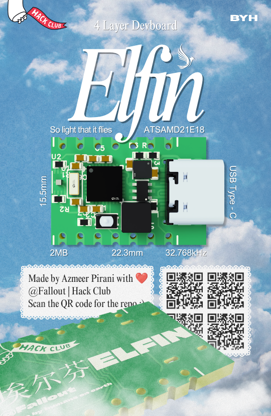

# 

A Tiny 4 Layer ATSAMD21E18A Development Board 

### _So light that it flies._

---

# Overview

**Elfin** is an ultra-compact ATSAMD21E18 development board desgined for makers, students, and embedded developers who need a decent microcontroller in smalled possible footprint.

Despite measuring only **22.2mm x 15.5mm**, Elfin packs everything required for rapid prototyping:

- ATSAMD21E18 Microcontroller
- USB Type-C Connectivity
- 2MB External Flash
- 32.768kHz Crystal Oscillator
- Fully Exposed GPIO
- 4-Layer PCB Design

Built for projects where every millimeter matters.

---

# Gallery

