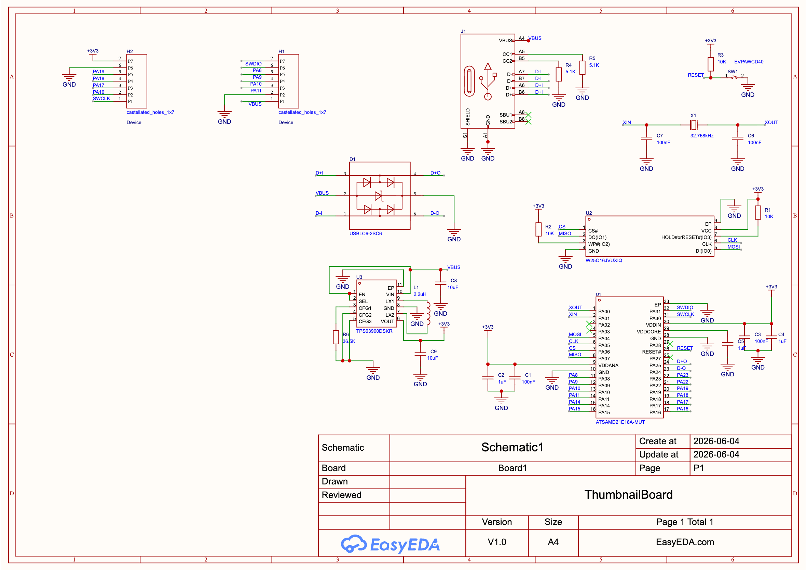
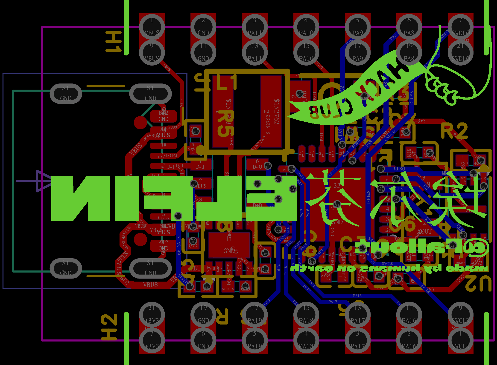

<div align="center">


# 

A Tiny 4 Layer ATSAMD21E18A Development Board 

<p>


</p>

### _So light that it flies._


</div>

---

# Overview

**Elfin** is an ultra-compact ATSAMD21E18 development board desgined for makers, students, and embedded developers who need a decent microcontroller in smalled possible footprint.

Despite measuring only **22.2mm x 15.5mm**, Elfin packs everything required for rapid prototyping:

- ATSAMD21E18 Microcontroller
- USB Type-C Connectivity
- 2MB External Flash
- 32.768kHz Crystal Oscillator
- Fully Exposed GPIO
- 4-Layer PCB Design

Built for projects where every millimeter matters.

---

# Gallery

<div align="center">


</div>

---

# Zine

<div align="center">

</div>

---

# Motivation

Most development boards are designed around convenience.

Elfin was designed around minimalism.

The goal was simple:

> How small can a fully featured ATSAMD21 development board become?

The project explored compact embedded hardware design while maintaining usability, manufacutrability, and flexibility.

Inspired by:
- Tiny embedded systems
- Wearable electronics
- Open-source hardware
- Hack Club hardware projects
- Minimalist engineering

The result is a board that feels compact in size while remaining practical for real-world development. (Not the smallest tho 🤓)

---

# Features

- **ATSAMD21E18 MCU**
- **USB Type-C**
- **2MB External Flash**
- **32.768kHz Crystal Oscillator**
- **4-Layer PCB**
- **Breadboard Friendly**
- **SWD Programming Support**
- **Fully Exposed GPIO**
- **Open Source Hardware**
- **Ultra Compact Design (22.2mm x 15.5mm)**

---

# Hardware Stack

| Parameter | Value |
|-------------------|--------------|
| MCU | ATSAMD21E18A |
| Internal Flash | 256KB |
|SRAM|32KB|
|Crystal|32.768kHz RTC Crystal|
|External Flash|2MB External SPI Flash|
|USB|USB Type-C|
|Operating Voltage|3.3V|
|PCB|4 Layer PCB (```Signal, Ground, Power, Signal```) |
|Programming|UF2 / SWD|
|Power|USB Powered|
|Dimensions|22.3mm x 15.5mm|

---

# BOM

|No.|Quantity|Comment                    |Designator |Footprint                                            |Value                      |Manufacturer Part|Manufacturer   |Supplier Part|Supplier|LCSC Price|
|---|--------|---------------------------|-----------|-----------------------------------------------------|---------------------------|-----------------|---------------|-------------|--------|----------|
|1  |4       |100nF                      |C1,C3,C6,C7|C0402                                                |100nF                      |                 |               |             |        |0.6342    |
|2  |3       |1uF                        |C2,C4,C5   |C0402                                                |1uF                        |CL05A105KA5NQNC  |SAMSUNG(三星)    |C52923       |LCSC    |          |
|3  |2       |10uF                       |C8,C9      |C0402                                                |10uF                       |                 |               |             |        |0.6342    |
|4  |1       |USBLC6-2SC6                |D1         |SOT-23-6_L2.9-W1.6-P0.95-LS2.8-BR                    |                           |USBLC6-2SC6      |ST(意法半导体)      |C7519        |LCSC    |          |
|5  |2       |castellated_holes_1x7      |H1,H2      |Carl Bugeja's Library.IntLib:castellated holes       |castellated holes          |                 |               |             |        |0.6342    |
|6  |1       |USB_C_Receptacle_USB2.0_16P|J1         |Connector_USB:USB_C_Receptacle_HCTL_HC-TYPE-C-16P-01A|USB_C_Receptacle_USB2.0_16P|                 |               |             |        |0.6342    |
|7  |1       |2.2uH                      |L1         |IND-SMD_L4.0-W4.0_XAL4030-332MEC                     |2.2uH                      |SMNR4020-2.2UH   |SXN(顺翔诺)       |C135262      |LCSC    |          |
|8  |3       |10K                        |R1,R2,R3   |R0402                                                |10K                        |                 |               |             |        |0.6342    |
|9  |2       |5.1K                       |R4,R5      |R0402                                                |5.1K                       |                 |               |             |        |0.6342    |
|10 |1       |36.5K                      |R6         |R0402                                                |36.5K                      |                 |               |             |        |0.6342    |
|11 |1       |EVPAWCD40                  |SW1        |KEY-SMD_L3.0-W2.0-LS3.5                              |                           |EVPAWCD40        |PANASONIC(松下)  |C2858606     |LCSC    |          |
|12 |1       |ATSAMD21E18A-MUT           |U1         |QFN-32_L5.0-W5.0-P0.50-TL-EP3.6                      |                           |ATSAMD21E18A-MUT |MICROCHIP(美国微芯)|C2052801     |LCSC    |          |
|13 |1       |W25Q16JVUXIQ               |U2         |USON-8_L3.0-W2.0-P0.50-BL-EP                         |                           |W25Q16JVUXIQ     |Winbond(华邦)    |C2843335     |LCSC    |          |
|14 |1       |TPS63900DSKR               |U3         |WSON-10_L2.5-W2.5-W0.50-TL-EP                        |                           |TPS63900DSKR     |TI(德州仪器)       |C1518762     |LCSC    |          |
|15 |1       |32.768KHz                  |X1         |OSC-SMD_L3.2-W1.5                                    |                           |32.768KHz        |               |C9900004736  |LCSC    |          |

---

# PCB Design

The PCB was designed with one objective:

> Maximum functionality in minimum space.

It has
- SWD debugging interface
- Optimized 4-layer routing

## PCB


## Schematic


---

# Assemble Guide

